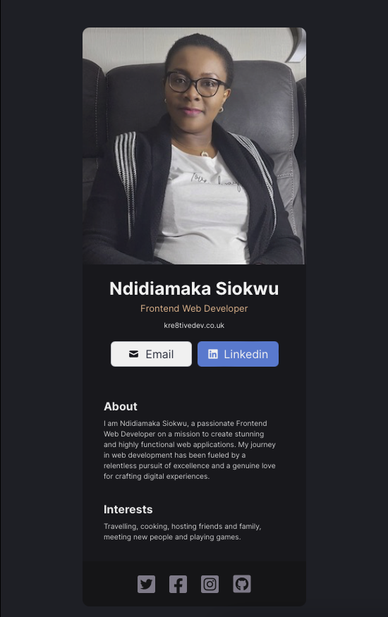

# My Digital Business Card

## Description
Presenting my digital business card, meticulously crafted with React and inspired by a sleek Figma design.

 ## Technologies
  * HTML
  * CSS 
  * JSX  
  * NPM  
  * React

 ## Screenshot
 

  ## Deployed Site
  https://playful-cupcake-3e6525.netlify.app

  ## License
  This project is licensed under the MIT License. [View licence](https://opensource.org/licenses/MIT)

  ## Questions
  Do you have any questions? Would you like to collaborate on a project?
  * Checkout my [github](https://github.com/ladykays).
  * Send me an [email](mailto:ladykerrion@yahoo.com).

## React + Vite

I have used the Vite setup to get React to work on Vite with HMR and some ESLint rules.

Currently, two official plugins are available:

- [@vitejs/plugin-react](https://github.com/vitejs/vite-plugin-react/blob/main/packages/plugin-react/README.md) uses [Babel](https://babeljs.io/) for Fast Refresh
- [@vitejs/plugin-react-swc](https://github.com/vitejs/vite-plugin-react-swc) uses [SWC](https://swc.rs/) for Fast Refresh
